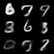

# Varational Auto Encoder

An implementation of Kingma's et al. Varational Auto Encoder.




## Usage

Main training and model at `src/`

To run and train:
```bash
cd src
python train.py
```

In depth breakdown in `drafts/notes.md` and Jupyter Notebook in `drafts/vae.ipynb`.
## References

Kingma, Diederik P., and Max Welling. “An Introduction to Variational Autoencoders.” Foundations and Trends® in Machine Learning, vol. 12, no. 4, 2019, pp. 307–92, <https://doi.org/10.1561/2200000056>.

Kingma, Diederik P, and Max Welling. “Auto-Encoding Variational Bayes.” arXiv.Org, 20 Dec. 2013, <https://arxiv.org/abs/1312.6114>.
