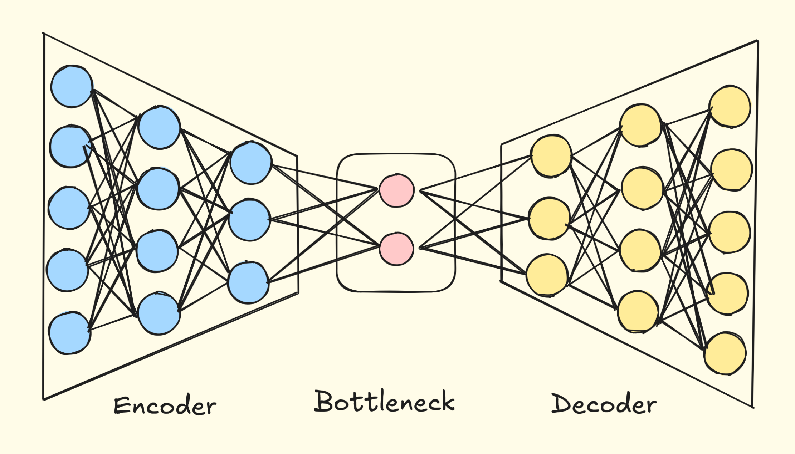
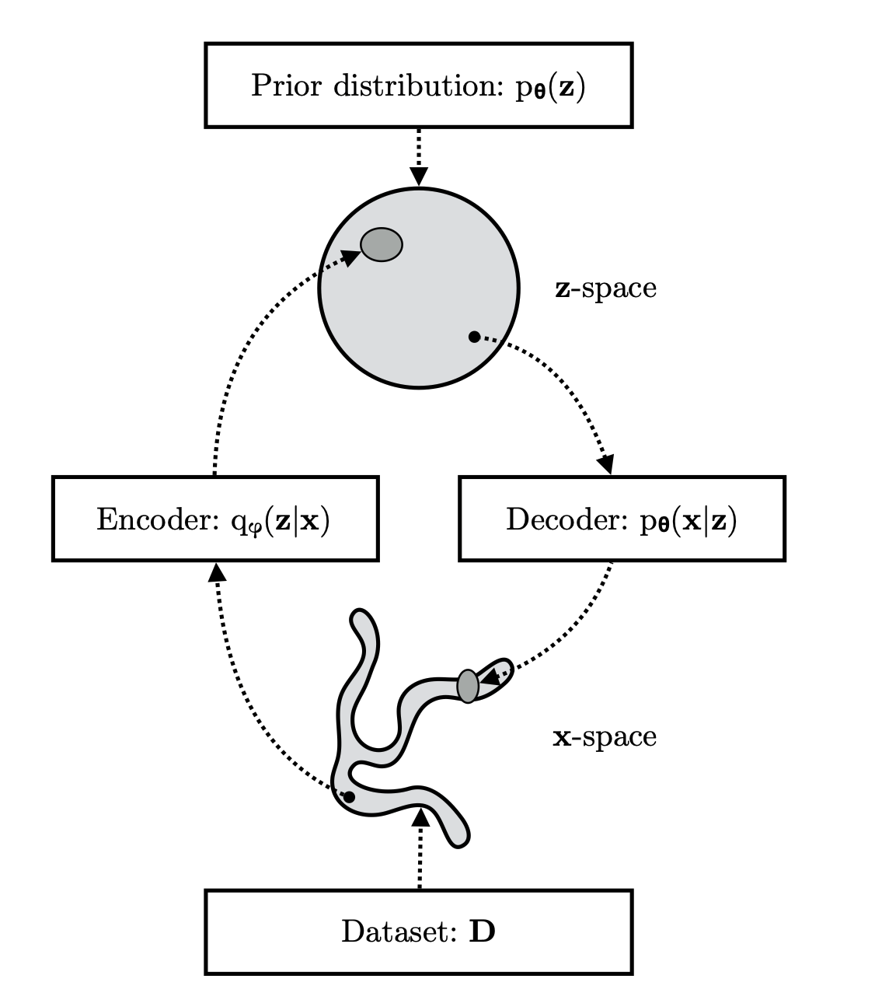
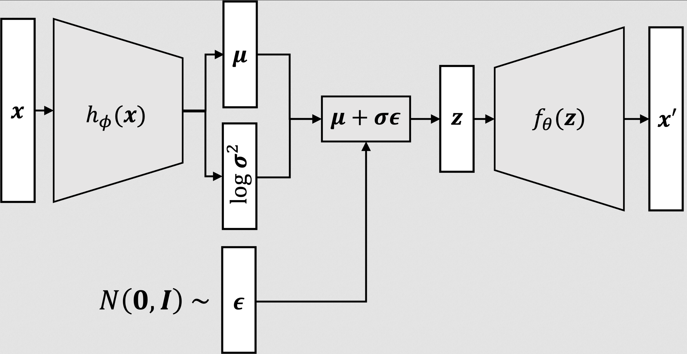
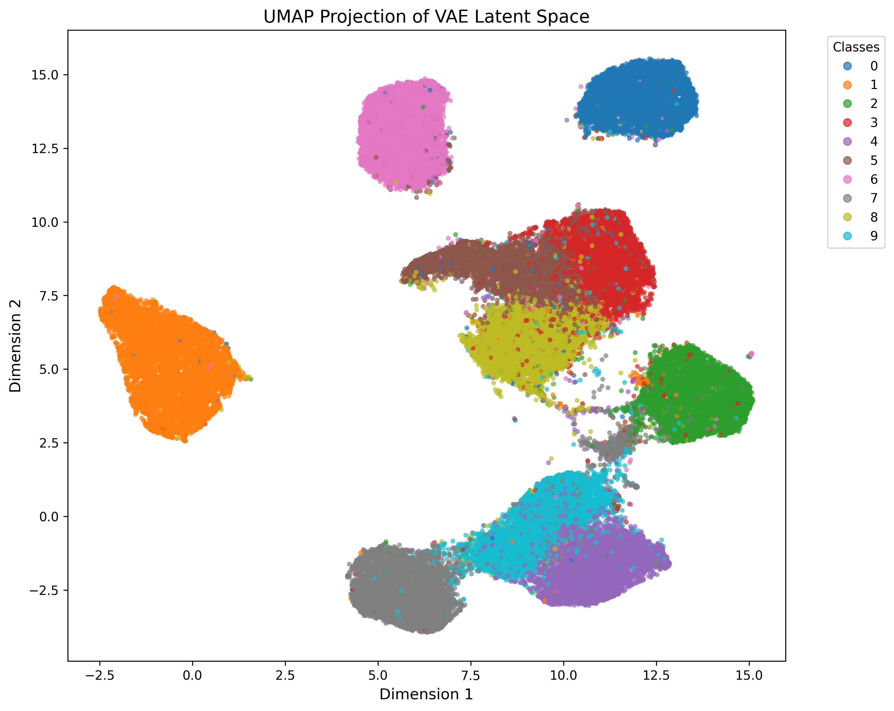

# notes
## Draft Versions

* `toyAutoEncode.ipynb` Overfit one image with standard autoencoder
* `mnistdraft.ipynb` Generalize on entire MNIST with standard autoencoder
* `vae.ipynb` Generalize and Sample on entire MNIST with VAE
* `conv2d.ipynb` OpenCode vibe coded convolutional overfit VAE test.

## Breakdown

Auto encoders encode high dimensional data vectors into low dimensional latents that can reconstructed. We train it via reconstruction L2 loss. $\boxed{\mathcal{L}_{L2} = \frac{1}{N} \sum_{i}^{N} \lVert x_{i} - \hat{x_{i}} \lVert_{2}^{2}}$

The main issue is that the latent space distrubution is not smooth or Guassian making it impossible to sample or interpolate, commonly outputting garbage. In a sense, we sample from the encoded latent space that is in the form of the following: $x \sim \mathcal{N}(\mu, 0) \iff x = \mu$

Variational Autoencoders solve this by instead forcing the encoded latents to be Guassian by "sampling" from the encoded latents by the outputted mean and log var, often represented as the following: $\mu$ and $\log \sigma^2$ respectively.

So we now sample from the encoded latent space in the form of following: $x \sim \mathcal{N}(\mu, \sigma^2)$. The model could just drive the $\sigma^2$ term to 0, reducing it back to a normal auto encoder so we guide it to take form of a Guassian via KL divergence loss.

There is an explicit formula for the DKL of $\mathcal{N}(\mu, \sigma^2)$ and $\mathcal{N}(0, I)$ which is the following:
$\boxed{D_{KL} = -\frac12 \sum_{i} \left(1 + \log \sigma^2 - \mu^2 - \sigma^2 \right)}$

So all together we get the following:
$\boxed{\mathcal{L}_{total} = \mathcal{L}_{L2} + D_{KL}}$

## Issues

We can't back propogate from straight up sampling from $x \sim \mathcal{N}(\mu, \sigma^2)$. We use the reparameterization trick which allows us to sample while also being differentiable.

$z = \sigma \odot \mathcal{N}(0, I) + \mu \iff z \sim \mathcal{N}(\mu, \sigma^2)$

Figure from [Matthew Bernstein's blog](https://mbernste.github.io/posts/vae/)

Posterior collapse occurs when the $D_{KL}$ term overpowers the $\mathcal{L}_{L2}$ reconstruction loss and causes the entire latent space to collapse into the average Guassian of the entire dataset input. To solve this, we scale the $D_{KL}$ term by a factor. This how the $\beta$-VAE mitigates this issue.

So in essence, we have another hyperparameter we can tune and possibly anneal. Simply tuning down the value once does the trick well.

$\boxed{\mathcal{L}_{total} = \mathcal{L}_{L2} + \beta \cdot D_{KL}}$

# UMAP 

A fun thing to do is to visualize and see the distrubution of the latent space. See we can see the clustering and the web structure of each digit in the latent space.

